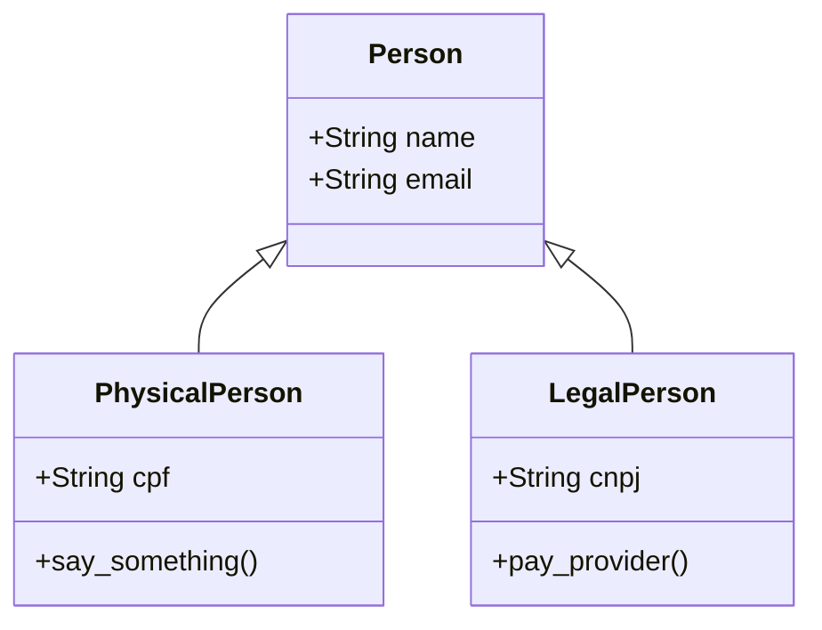

## Class diagram with Mermaid (example)

<!--
Tentar explicar o algoritmo aqui
INICIO
Usuário clica no botão de escanear QR Code ou Código de Barras
Usuário abre a imagem e clica no OK
Usuário seleciona a imagem

FIM
Tentar expressar o algoritmo no exemplo abaixo

 -->
